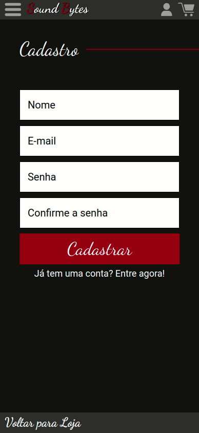

# SoundBytes Store

An e-commerce app design for mobile use. Developed by [Alan Andrade](https://github.com/Alan-A-Andrade) and me.

  

                                                                    
Try it out now at https://sound-bytes-front-onegoodgui.vercel.app/

## About

This application is focused on a FullStack development Product, from planning, design, implementation and deployment, using the tecnologies:

- reactJs
- Nodejs
- MongoDB

## Technologies
The following tools were used in the construction of the project: 
    
